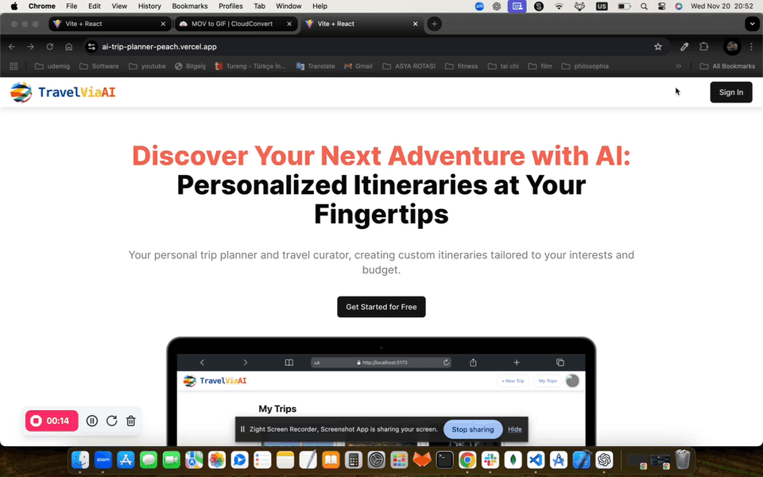
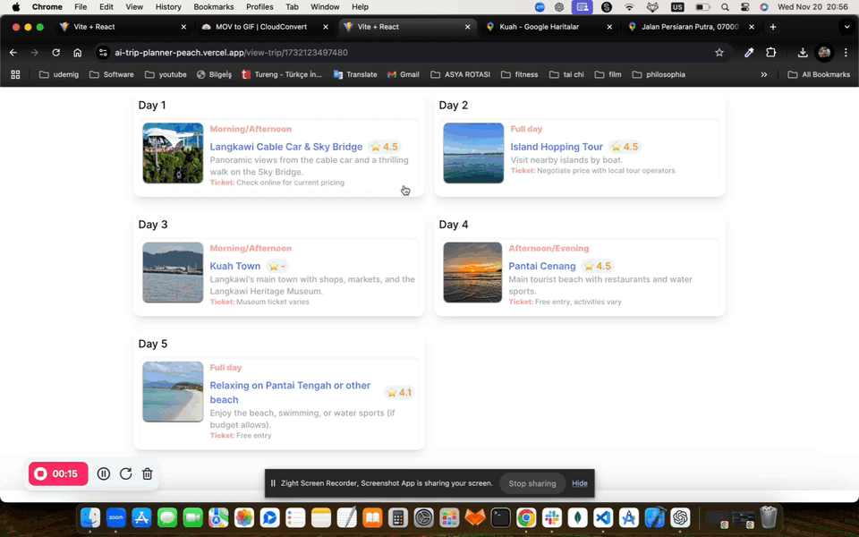

# AI Travel Planner

  
  
  


**AI Travel Planner** is a web application that utilizes Google's Gemini AI to create personalized travel itineraries based on user preferences. Users can input details such as their desired destination, travel dates, budget, and interests to generate customized trip plans, including accommodations, activities, and dining recommendations.

## 🚀 Features

- **AI-Powered Itinerary Generation:** Utilizes Google's Gemini AI to create tailored travel plans based on user inputs.
- **Destination Search:** Integrated with Google Places Autocomplete for seamless destination selection.
- **User Authentication:** Secure sign-in with Google OAuth 2.0.
- **Responsive Design:** Styled with TailwindCSS to ensure a mobile-first, responsive user interface.
- **Notifications:** Real-time feedback and alerts implemented with Sonner.
- **Data Base:** Firebase Firestore is used for keeping datas in the app.

## 🛠️ Installation

1. **Clone the repository:**

   ```bash
   git clone https://github.com/ugurkurkcu/AI_Trip_Planner

2.	**Navigate to the project directory:**

    cd AI_Trip_Planner

3.	**Install dependencies:**

    npm install

4.	**Start the development Server:**

    npm run dev

## 🧰 Technologies Used

1.	**React:**
JavaScript library for building user interfaces.
2.	**Vite:**
Next-generation frontend tooling for fast development.
3.	**TailwindCSS:**
Utility-first CSS framework for rapid UI development.
4.	**Google Generative AI SDK:**
Accesses Google’s Gemini AI for generating travel itineraries.
5.	**Google Places Autocomplete:**
Provides location-based search functionality.
6.	**Google OAuth 2.0:**
Enables secure user authentication.
7.	**Sonner:**
Library for displaying notifications and alerts.
8.	**Axios:**
Promise-based HTTP client for making API requests.
9.	**React Router DOM:**
Facilitates navigation and routing within the application.
10.	**Firebase:**
Backend-as-a-Service for data storage and user authentication.

## 🌐 Contributing

Contributions are welcome! Please fork the repository and submit a pull request with your changes.


## 📄 License

This project is licensed under the MIT License. See the LICENSE file for details.

## 📧 Contact

For further information or support, feel free to reach out at:
	•	Email: [click](uurkurkcu@gmail.com)
	•	GitHub: [ugurkurkcu](https://github.com/ugurkurkcu)